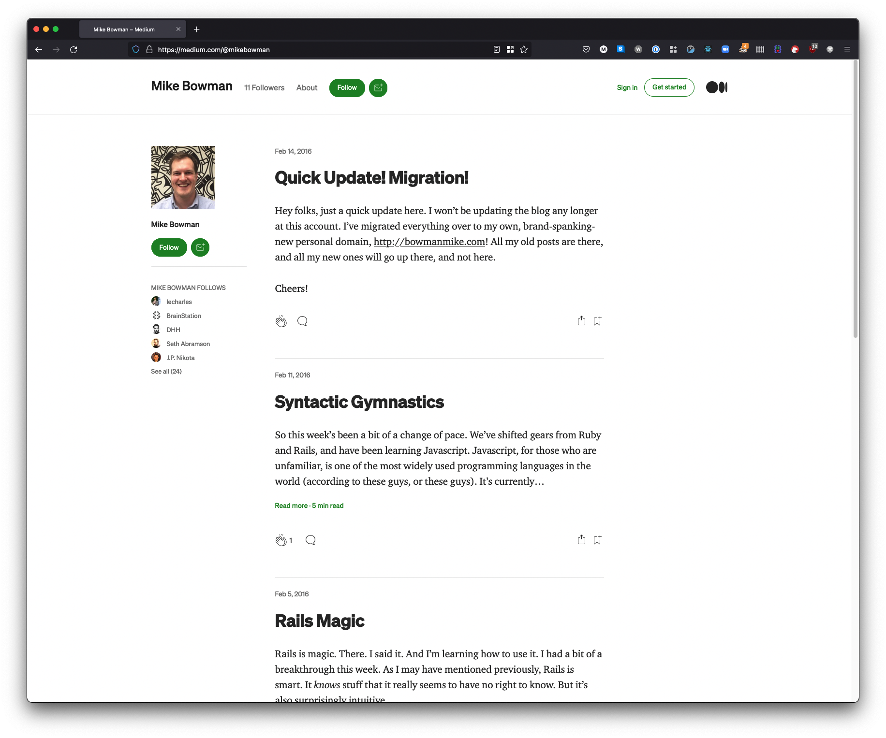
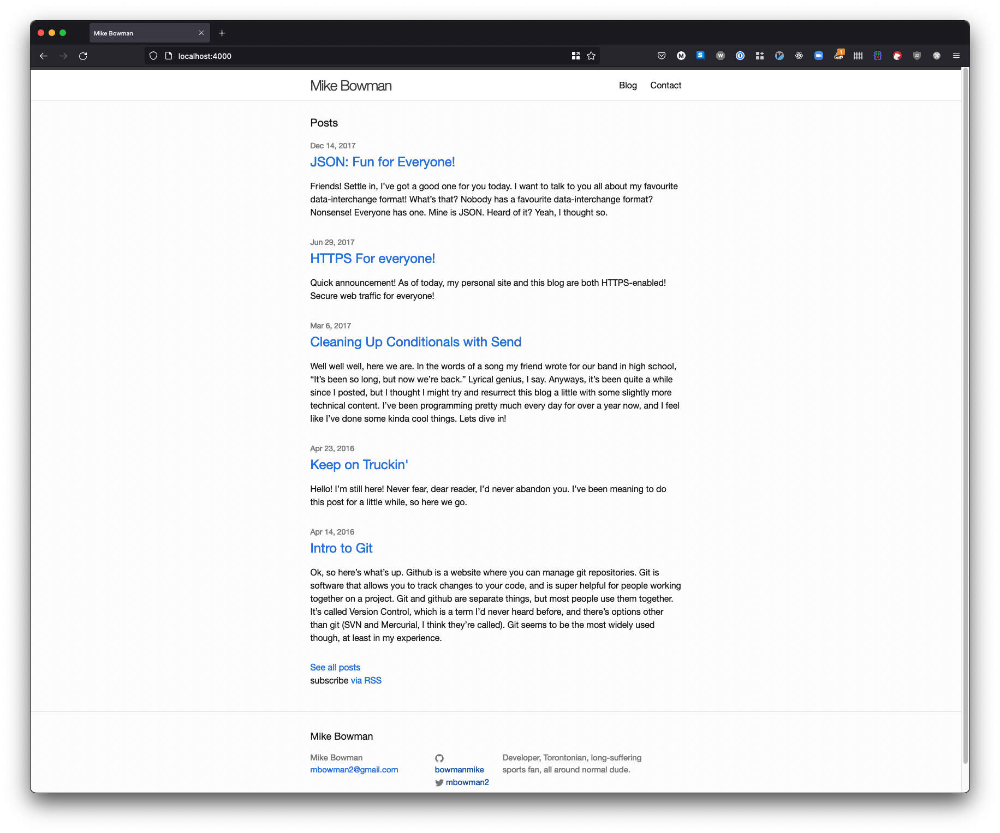
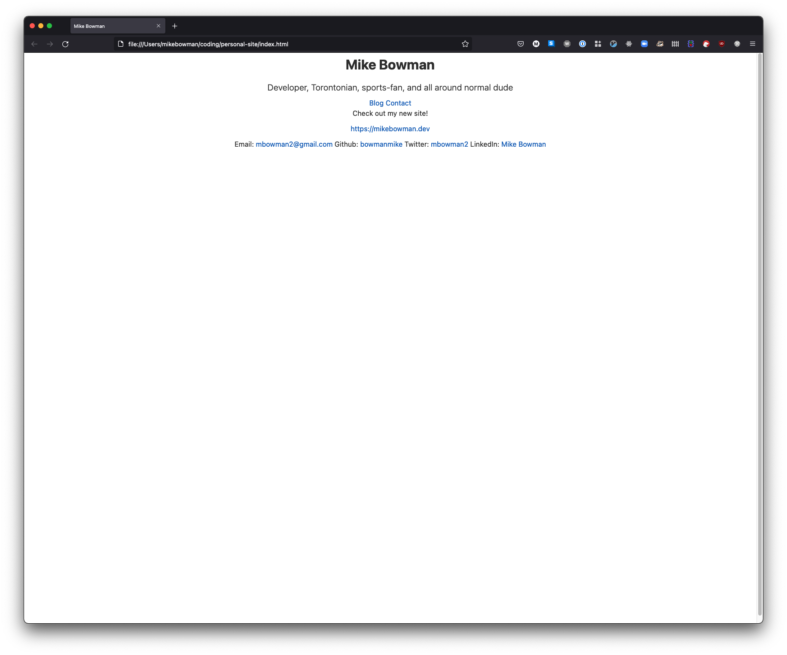

So let's talk about blogs. This one, in particular, and it's evolution over the
years. After all, this site wasn't built in a day, and neither was Rome. That's
the expression, right?<!-- endexcerpt -->

This post will be in two parts. First, I'll talk about the history of my
personal site, in its various incarnations, including this one. After, I'll get
a bit technical, and get into the nitty gritty of how this new site works. If
that's not your thing, my apologies, but feel free to just skip it!

Early on in my days at Bitmaker (the coding bootcamp I attended in 2016), they
stressed to us the importance of maintaining an online presense. This seemed
like a good idea to me, so I went home that night and started a
[blog on Medium](https://medium.com/@mikebowman). It looked something like this,
and it's actually still live as of January 17, 2022.

Nothing too fancy, but it certainly got the job done. Medium is a popular
writing platform among tech types, and it worked for me for a while. However,
pretty soon I got an itch. An itch to do something a little more challenging.
Something a little more fancy, a little more tech-y. I wanted to boost my tech
street-cred, more or less. I figured that the best way to get that done would be
to build my own site, and host it on my very own domain name. So I went off and
bought [bowmanmike.com](https://bowmanmike.com). My first choice,
*mikebowman.com*, was (and still is) owned by a real-estate agent from Dallas,
so that one was a no-go. But [bowmanmike.com](https://bowmanmike.com) seemed
like a solid option.

So there I was, shiny new domain name in hand. I got to thinking, how does one
build a blog? At some point during the bootcamp, we were introduced to
[Jekyll](https://jekyllrb.com). It fit the bill perfectly. I was able to write
my blog posts using [Markdown](https://www.markdownguide.org/), which I liked.
It was simple to set up, had lots of pre-made themes available, and was
reasonably customizable. I got it wired up to my own domain name, and off I
went. This was a solid solution, if somewhat visually unremarkable. It isn't
live on the internet anywhere at the moment, but it looked like this.

Plain, simple, functional.

But kinda boring, and not really very technically interesting.

As you can see from the post history here, the blog kinda withered on the vine
for a few years. I didn't post at all between 2018 and 2020. I didn't really
have the time or energy to write, and I probably also thought that I didn't have
anything worth writing about. Not sure if that was actually true, but whatever
the reasoning, I went for several years without writing any posts.

But! I still wanted to exist on the web. I still had my domain name, so I
figured I should at least put up a simple page with some contact info and
whatnot. I never got very far down the road of building this particular site,
but it did exist for a while, and it looked like this.

Very plain, but at least if somebody were to visit
[bowmanmike.com](https://bowmanmike.com), there'd be something there.

This brings us to today. Obviously, you're looking at my new site, so there's
not much to add here. I'm really happy with the design. It's not a template,
it's an original design that I worked out with some assistance from some people
with better eyes for design than I have. But ultimately, it's my own. I can say
I built it from scratch. I know the ins and outs, I know how it works. I know
where all the styles are coming from, and there's no template magic hidden
behind the scenes. I'm thrilled with the result, and I hope you like it too!

This brings us to the technical portion. Like I said, if this isn't your thing,
feel free to stop reading, and maybe click on one of the other pages I've got
here! For those brave enough, lets forge ahead!

This site is generated using [Gatsby](https://gatsbyjs.com). Gatsby, in many
ways, is a spiritual successor to Static Site Generators like
[Jekyll](https://jeklyyrg.com) or [Hugo](https://gohugo.io/). Those tools allow
you to generate a full site ahead of time, and just render out raw HTML (and
some Javacsript, if you want). This means all you need to host it a static site,
which has a bunch of benefits when it comes to things like simplicity of
hosting, deployment, SEO, speed, accessibility... all that good stuff. Browsers
are *really* good at optimising HTML, and servers and hosting platforms are also
*really* good at optimising their delivery.

However, they can be a bit limited in their functionality. As soon as you need
to do things like dynamically load data, they lose a lot of their benefits.
For example, if you're loading your blog posts from a headless CMS or something
similar, you'll need to query all that data at runtime, which takes a non-zero
amount of time. There isn't really an easy way around it. This is where Gatsby
(and other, more modern, Static Site Generators) shine.

Gatsby does a lot more work for you at build time. Gatsby has the concept of
"sources", which are adapters to various data sources. This blog, for example,
exists as a collection of markdown files. In order to do some magic like
pagination, or showing a preview of the most recent post on the home page,
they're imported into Gatsby through a markdown transformer, called
[Remark](https://remark.js.org/). This brings us to the key to Gatsby's ability
to dynamically generate a site: it's GraphQL API.

Gatsby lets you build your static site using React, and it uses GraphQL at
build-time to dynamically generate various pages and pieces of data. When the
site builds, Gatsby spins up an GraphQL API. In your React components (and a few
other places, but that's not really important right now), you can define queries
that run *at build time* against that API. This lets you, for example,
dynamically load your blog posts to build an index page with pagination, or a
preview component. These pages are then rendered to static HTML and served to
the client just like Jekyll.

Gatsby does sprinkle in some Javascript on the client-side to optimize a few
things, such as page navigation and image loading, but the key point here is
that the site works *perfectly well* without Javascript. At it's core, it's a
simple HTML and CSS page that the browser renders. No magic, no dynamically
loading data, just a quick, snappy, browser-native page.

Speaking of CSS, since Gatsby is a React app at build-time, you can use whatever
CSS strategy you like. Inline CSS, CSS Modules, Styled Components, PostCSS,
everything you'd expect to see in a modern React app is available. Personally, I
like [TailwindCSS](https://tailwindcss.com), but you may have other opinions on
the matter. Fortunately, Gatsby does not care a lick about how you want to do
your CSS, so style those components to your heart's content, friendo.

This is far from a full overview of what Gatsby is capable of, but here's a few
other things it can take care of for you:

- Typescript! Yes, you can build your Gatsby app in Typescript. I haven't used
  it here, but moving over to TS is on my to-do list!
- Accessibility! Gatsby comes with some nice Accessibility features built in,
  like adding ARIA attributes to your navigation link, progressively loading and
  scaling images for those on slower connections, and more!
- Progressive Web Apps and offline access
- A rich ecosystem of plugins that can help with the difficult or boring parts
  of web development.

While there's lots more of Gatsby you can investigate, this is a quick rundown
of how it works, and how I'm using it. I hope you found something useful in
here! There's some links below that may provide more context for some of the
tech discussed in this post.

Until next time, cheers!

#### Links

- [GatsbyJS](https://gatsbyjs.com)
- [TailwindCSS](https://tailwindcss.com)
- [React](https://reactjs.com)
- [GraphQL](https://graphql.org/)
